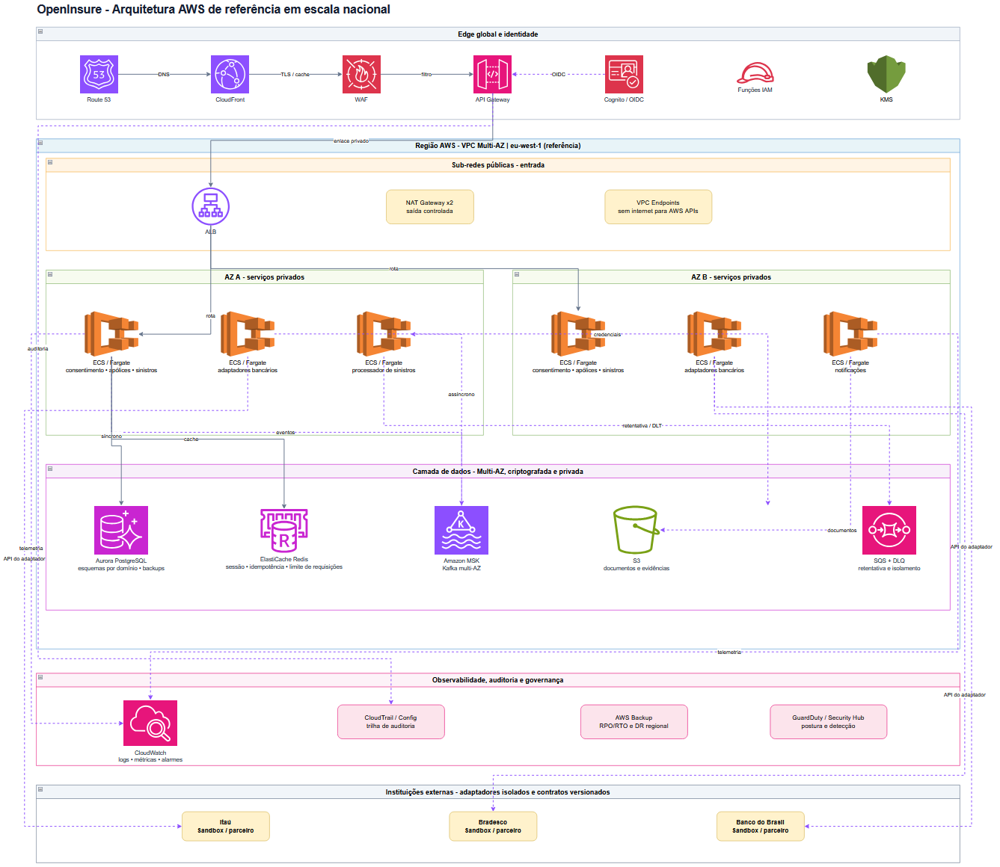
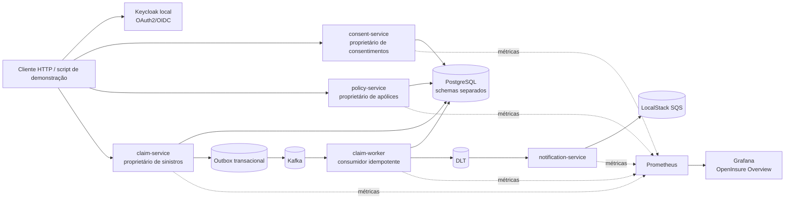

# OpenInsure Lab

> Um estudo de caso de engenharia backend em Java para seguros, executável localmente com Docker Compose.

[](https://openjdk.org/projects/jdk/25/)
[](https://spring.io/projects/spring-boot)
[](https://kafka.apache.org/)
[](https://docs.docker.com/compose/)

OpenInsure Lab é um laboratório local e fictício inspirado em uma plataforma de Open Insurance. O projeto foi construído como um **study case de portfólio** para demonstrar decisões de arquitetura, contratos, persistência, mensageria, segurança e observabilidade em um fluxo vertical completo.

O sistema não é uma implementação certificada de Open Insurance, não usa dados reais. As integrações externas são representadas por contratos e adaptadores locais, com dados sintéticos reproduzíveis.

## O que este case study demonstra

- APIs HTTP desenhadas primeiro em OpenAPI, com erros `application/problem+json`.
- Separação de propriedade de dados entre consentimentos, apólices e sinistros.
- Autorização contextual considerando identidade, titularidade, escopo, finalidade, expiração e revogação.
- PostgreSQL com Flyway, schemas separados e restrições de integridade.
- Outbox transacional para publicar eventos sem perder a relação entre gravação e mensageria.
- Kafka com chave de partição por `claimId`, idempotência, retry limitado e Dead Letter Topic (DLT).
- OAuth2/OIDC local com Keycloak e escopos de demonstração.
- Métricas Micrometer/Prometheus, logs estruturados, tracing local e dashboard Grafana.
- AWS SDK apontando para LocalStack, sem qualquer chamada a uma conta AWS real.
- Providers sintéticos de Itaú, Bradesco Seguros e Banco do Brasil, com contratos comuns e métricas por instituição.
- Testes unitários, testes de integração e uma demonstração ponta a ponta com dados sintéticos.

## Arquitetura

A arquitetura AWS de referência está disponível em dois formatos:



- [Abrir o diagrama editável no draw.io](docs/architecture/architecture.drawio)
- [Baixar a imagem em alta resolução](docs/architecture/architecture.png)

O desenho representa uma arquitetura-alvo para um ambiente de grande escala, com VPC Multi-AZ, ECS/Fargate, Aurora PostgreSQL, ElastiCache, Amazon MSK, SQS/DLQ, observabilidade e adaptadores para instituições externas. Ele é um estudo de caso local e não representa uma conta AWS real ou uma integração produtiva.



### Propriedade dos dados

| Componente             | Responsabilidade e dados próprios                                         |
| ---------------------- | ------------------------------------------------------------------------- |
| `consent-service`      | Consentimentos, finalidade, escopos, titularidade, expiração e revogação. |
| `policy-service`       | Apólices e dados fictícios de clientes necessários ao laboratório.        |
| `claim-service`        | Sinistros, idempotência de comandos e outbox de eventos.                  |
| `claim-worker`         | Processamento assíncrono de eventos e deduplicação por consumidor/evento. |
| `notification-service` | Notificações derivadas de falhas permanentes, publicadas na fila local.   |

Nenhum serviço consulta diretamente as tabelas pertencentes a outro domínio.

## Stack

- Java 25 e Maven Wrapper.
- Spring Boot 4.1.1, Spring Web, Validation, Data JPA, Security e Actuator.
- PostgreSQL 17.6 e Flyway.
- Apache Kafka 4.1.2.
- Keycloak 26.7.4.
- Micrometer, Prometheus, Grafana e OpenTelemetry local.
- LocalStack para simular SQS.
- JUnit 5, Mockito e Testcontainers nos testes aplicáveis.

Referências oficiais: [Java 25](https://openjdk.org/projects/jdk/25/), [Spring Boot](https://spring.io/projects/spring-boot), [Apache Kafka](https://kafka.apache.org/), [Keycloak](https://www.keycloak.org/), [Docker Compose](https://docs.docker.com/compose/) e [LocalStack](https://docs.localstack.cloud/).

## Executando localmente

### Pré-requisitos

- Docker Desktop com Docker Compose v2.
- PowerShell 7 para os scripts de demonstração.
- Java 25 para executar o Maven fora dos containers.

O `JAVA_HOME` usado no ambiente de desenvolvimento deste projeto aponta para uma instalação local de Java 25, por exemplo:

```powershell
$env:JAVA_HOME = 'C:\Users\{user}\AppData\Local\OpenInsure\jdk-25.0.4.1+1'
$env:Path = "$env:JAVA_HOME\bin;$env:Path"
java -version
```

### Subir o núcleo

```powershell
Copy-Item .env.example .env
docker compose config
docker compose up --build -d
docker compose ps
```

Para subir também observabilidade, Keycloak e a simulação de AWS local:

```powershell
docker compose --profile observability --profile aws-lab up --build -d
```

Endereços úteis:

| Recurso          | URL                             |
| ---------------- | ------------------------------- |
| Grafana          | http://localhost:3000           |
| Prometheus       | http://localhost:9090           |
| Keycloak         | http://localhost:8080           |
| LocalStack       | http://localhost:4566           |
| Consent service  | http://localhost:8081           |
| Policy service   | http://localhost:8082           |
| Claim service    | http://localhost:8083           |
| Provider catalog | http://localhost:8084/providers |

Os healthchecks podem ser conferidos com:

```powershell
docker compose ps
docker inspect --format='{{.Name}} {{.State.Health.Status}}' openinsure-consent-service openinsure-policy-service openinsure-claim-service openinsure-claim-worker
```

## Demonstração do fluxo

O script abaixo cria consentimento e sinistros sintéticos, repete uma requisição usando `Idempotency-Key`, força uma falha permanente no consumidor e consulta métricas do dashboard:

```powershell
pwsh -NoProfile -File .\docs\dashboard-demo.ps1
```

Abra o dashboard em [Grafana](http://localhost:3000/d/openinsure-overview/openinsure-overview?orgId=1&from=now-15m&to=now&timezone=browser). Os painéis exibem, entre outros dados:

- sinistros publicados a partir da outbox;
- eventos processados pelo worker;
- eventos encaminhados para DLT;
- lag do consumidor Kafka;
- notificações enviadas para a fila SQS local.

Os valores são **demonstrativos e locais**. O painel identifica os principais fluxos como `synthetic local`; o lag é um gauge operacional do laboratório, não uma medição de uma frota produtiva.

O catálogo multi-provider pode ser consultado diretamente:

```powershell
Invoke-RestMethod http://localhost:8084/providers
Invoke-RestMethod http://localhost:8084/providers/itau/policies
Invoke-RestMethod http://localhost:8084/providers/bradesco-seguros/claims
Invoke-RestMethod http://localhost:8084/providers/banco-do-brasil
```

Esses providers são fixtures sintéticas em ambiente `prod-like-local`. O Banco do Brasil é representado no fluxo de pagamentos; Itaú e Bradesco Seguros também possuem dados fictícios de seguros. Nenhum endpoint chama uma API externa.

Para a sequência HTTP detalhada, consulte [`docs/demo.md`](docs/demo.md). As credenciais e tokens usados na demonstração são fixtures locais e não devem ser reutilizados fora deste ambiente.

### Como obter credenciais Sandbox

O projeto não inclui credenciais externas. Para testar adapters autorizados em Sandbox, use os portais oficiais:

| Instituição      | Portal                                                                                                                | Condição principal                                                                       |
| ---------------- | --------------------------------------------------------------------------------------------------------------------- | ---------------------------------------------------------------------------------------- |
| Itaú Unibanco    | [Itaú for Developers](https://devportal.itau.com.br/)                                                                 | Criar conta/projeto; algumas APIs dependem de seleção, contrato ou aprovação.            |
| Bradesco Seguros | [Portal de APIs Bradesco Seguros](https://apiportal.bradescoseguros.com.br/pages/Portal_UI_Bundle/index.html)         | Acesso para empresas parceiras; collections disponíveis para DEV/HML conforme liberação. |
| Banco do Brasil  | [Portal Developers BB](https://apoio.developers.bb.com.br/) e [área de aplicações](https://app.developers.bb.com.br/) | Criar aplicação, selecionar APIs e gerar credenciais para Sandbox.                       |

O Sandbox não é produção. Os fluxos de autenticação, limites, APIs disponíveis e processo de habilitação variam por instituição. O acesso produtivo exige credenciamento, aprovação, credenciais específicas e, em alguns casos, OAuth2/mTLS e certificados. Consulte sempre a documentação do produto escolhido antes de implementar um adapter externo.

Para desenvolvimento local, mantenha os segredos somente no ambiente da máquina:

```powershell
$env:ITAU_CLIENT_ID = 'sandbox-client-id'
$env:ITAU_CLIENT_SECRET = 'sandbox-client-secret'
$env:BRADESCO_CLIENT_ID = 'sandbox-client-id'
$env:BRADESCO_CLIENT_SECRET = 'sandbox-client-secret'
$env:BB_CLIENT_ID = 'sandbox-client-id'
$env:BB_CLIENT_SECRET = 'sandbox-client-secret'
```

Nunca publique `client_secret`, tokens, certificados ou chaves privadas. O modo padrão deste repositório continua sendo `synthetic`, sem chamadas externas:

```yaml
openinsure:
  provider: synthetic
  environment: local
```

## Contratos e APIs

Os contratos fonte estão em [`contracts/http`](contracts/http) e os eventos em [`contracts/events`](contracts/events). O catálogo multi-provider está em [`contracts/http/providers.yaml`](contracts/http/providers.yaml). Exemplos de endpoints:

| Domínio       | Endpoints principais                                                 |
| ------------- | -------------------------------------------------------------------- |
| Consentimento | `POST /consents`, `GET /consents/{id}`, `POST /consents/{id}/revoke` |
| Apólice       | `GET /policies/{policyId}`                                           |
| Sinistro      | `POST /claims`, `GET /claims/{claimId}`                              |

`POST /claims` exige `Idempotency-Key`. A mesma chave com o mesmo corpo retorna o mesmo resultado; a mesma chave com corpo diferente retorna `409 Conflict`. As respostas de erro seguem o formato Problem Details.

## Build e testes

Com Java 25 configurado no host:

```powershell
.\mvnw.cmd -B verify
```

O build de imagem também pode compilar e testar usando Java 25 dentro do Docker, sem depender da versão de Java instalada no host:

```powershell
docker run --rm -v "${PWD}:/workspace" -w /workspace `
  maven:3.9.12-eclipse-temurin-25 `
  mvn -B -pl services/claim-worker,services/notification-service -am test
```

Integrações que dependem de PostgreSQL, Kafka, Keycloak ou LocalStack precisam do Docker em execução. Sem Docker, ainda é possível executar validações de código e testes unitários compatíveis com o ambiente local.

O pipeline de CI está em [`.github/workflows/ci.yml`](.github/workflows/ci.yml).

## Decisões técnicas relevantes

- **Outbox transacional:** o sinistro e seu evento são persistidos na mesma transação; a publicação pode ser repetida com segurança.
- **Idempotência no consumidor:** efeitos locais são protegidos por uma restrição única por consumidor/evento.
- **Retry e DLT:** falhas transitórias têm retry limitado; mensagens inválidas ou permanentemente falhas seguem para DLT e podem gerar notificação local.
- **Decisão síncrona de consentimento:** a revogação bloqueia o acesso imediatamente, sem depender da propagação de um evento assíncrono.
- **Observabilidade local:** Prometheus e Grafana tornam o comportamento do laboratório visível, mas não equivalem a uma operação gerenciada em produção.
- **AWS simulada:** LocalStack permite exercitar o adaptador SQS sem credenciais, recursos ou custos de uma conta AWS real.

## Status do case study

| Fase   | Resultado                                                                                        |
| ------ | ------------------------------------------------------------------------------------------------ |
| Fase 0 | Implementada e demonstrada: estrutura, build, Compose, healthchecks e documentação.              |
| Fase 1 | Implementada e demonstrada: contratos HTTP, consentimento, apólice, sinistro e migrações.        |
| Fase 2 | Implementada e demonstrada: Kafka, outbox, worker, idempotência, retry e DLT.                    |
| Fase 3 | Implementada e demonstrada: Keycloak, OAuth2/OIDC, escopos e autorização contextual.             |
| Fase 4 | Implementada e demonstrada: métricas, logs, tracing local, Grafana e CI.                         |
| Fase 5 | Implementada e demonstrada: extensões locais opcionais e desenho de integração com AWS simulada. |

### Fora do escopo

- Participantes reais, dados pessoais ou integração com instituições financeiras reais.
- Adapters Sandbox/produção habilitados por padrão; eles dependem de credenciais e autorização do respectivo provedor.
- Deploy em AWS, RDS, MSK, ECS/Fargate, IAM ou CloudWatch.
- Garantia de exactly-once para efeitos externos.
- Certificação regulatória ou conformidade jurídica de Open Insurance.
- Hardening completo de produção, alta disponibilidade e gestão corporativa de segredos.

## Estrutura do repositório

```text
open-insurance-platform/
├── contracts/                 # OpenAPI HTTP e contratos de eventos
├── docs/                      # Demo, decisões e evidências operacionais
├── infra/                     # Flyway, Kafka, Keycloak e observabilidade
├── services/
│   ├── consent-service/
│   ├── policy-service/
│   ├── claim-service/
│   ├── claim-worker/
│   ├── notification-service/
│   └── provider-service/      # Providers Itaú/Bradesco/BB sintéticos
├── compose.yaml
├── Dockerfile
├── pom.xml
├── mvnw / mvnw.cmd
├── AGENTS.md
└── OPENINSURE-PROJECT-SPEC.md
```

## Encerrando o ambiente

```powershell
docker compose down
```

Use `docker compose down -v` somente quando quiser remover também os volumes locais e reiniciar todos os dados do laboratório.

## Licença e propósito

Este repositório é um projeto educacional e demonstrativo para estudo de arquitetura backend. As marcas e tecnologias citadas pertencem aos seus respectivos proprietários; o projeto não representa uma implementação oficial ou certificada de nenhuma instituição.
